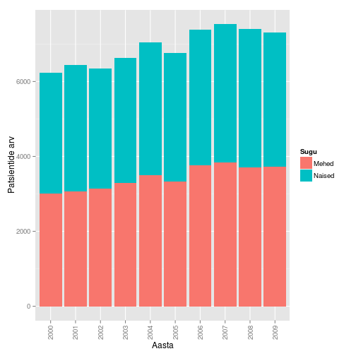
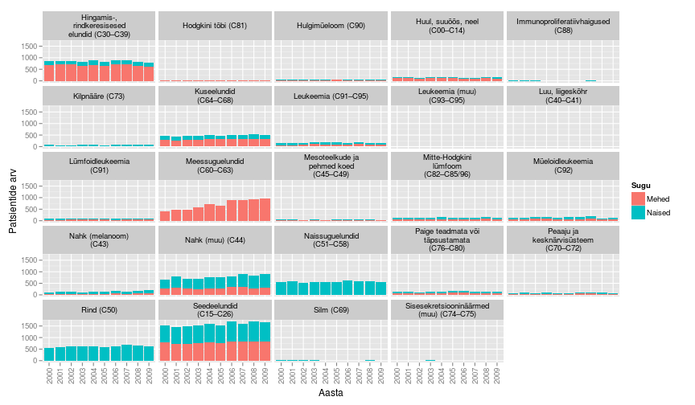
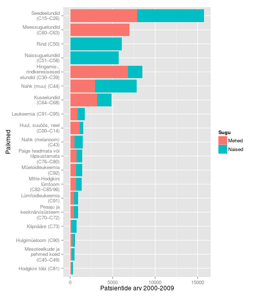
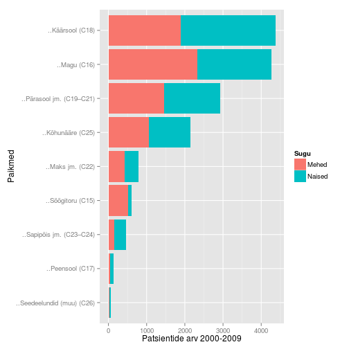
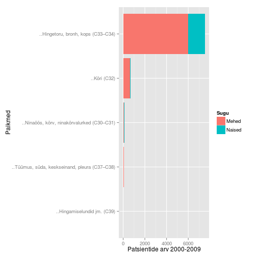

<!-- Limit image width and height -->

<!-- Center image on slide -->

--- .segue .dark .nobackground

## Sissejuhatuseks

--- 
## Vähk
- Mõiste vähk (tuumor, pahaloomuline kasvaja, neoplasm) tähistab suurt hulka erinevaid haiguseid (NCI ~160 olulisemat) mis võivad tekkida kõigis keha kudedes. 
- Vähi tunnuseks on ebanormaalsete rakkude kasv väljapoole nende normaalseid piire. Kõrvalolevate kudede invasioon ja levik teistesse organitesse ehk metastaseerumine.  
- Metastaasid on ka enamuse kasvajatest tingitud surmade põhjustajaks.

[A to Z List of Cancers](http://www.cancer.gov/cancertopics/types/alphalist)

---
# WHO andmetel
- Vähkkasvajad on maailmas üks juhtivatest surma põhjustatavatest haigustest, nõudes 8.2 miljonit elu 2012. a (EU-27 osakaal 2012: 1.27 miljonit (15%))
- Kopsu-, maksa-, mao-, kolorektaal- ja rinnakasvajad põhjustavad enim 
vähisurmasid
- sagedasemad vähitüübid on naistel ja meestel erinevad
- ~30% vähisurmadest on tingitud viiest käitumis ja dieediriskist: kõrge BMI, vähe puu- ja aedvilju menüüs, vähene füüsiline aktiivsus, tubakas/suitsetamine, alkohol
- arengumaades põhjustavad 20% vähkidest hepatiidi viirused B ja C ning papilloomiviirused
- ennustatkse, et haigestumus suureneb maailmas 14 miljonilt 2012.a 22 miljonini 2030ndatel

---
Kõige sagedasemad surmaga lõppevad vähid maailmas, 2012 aasta seis:

- kops (1.59 miljonit surma)
- maks (745 000)
- magu (723 000 deaths)
- kolorektaal (694 000)
- rinnavähk (521 000)
- söögitoru (400 000)

---
## Kasvajatesse haigestumus Eestis

Andmed: TAI vähiregister

---
## Kasvajad Eestis paikmete kaupa

Andmed: TAI vähiregister

---
## Sagedasemad paikmed

---
## Seedelundkond

--- 
## Rindkere

---
## Esmased vähid ja 5 aasta suremus

Pilt: Marshall, 2011.

---
## Vähiravi/teraapiad
- lõikus
- kemoteraapia,
- kiiritusravi,
- märklaud teraapiad
  - bioloogiline ravi
- angiogeneesi inhibiitorid

---
## Vähiravimid
Top 10 best-sellerit vähiravimite hulgas 2013 (maailmas):

Bränd | näidustus | globaalne müük | firma (aktsia)
------| --------- |----------------| ------
Rituxan/MabThera | non-Hodgkin's lymphoma, CLL | $7.78 billion | Roche (RHHBY36.56+0.14%)
Avastin | Colorectal, lung, ovarian and brain cancer | $6.75 billion | Roche
Herceptin| Breast, esophagus and stomach cancer | $6.56 billion | Roche
Gleevec| Leukemia, GI cancer | $4.69 billion | Novartis (NVS93.71+4.31%)
Alimta | Lung cancer | $2.7 billion | Eli Lilly (LLY63.68+0.19%)
Velcade |  Multiple myeloma | $2.6 billion | Takeda, J&J (JNJ103.36-0.36%)
Erbitux | Colon and head and neck cancer| $1.87 billion |  Merck, BMS (BMS40.72-0.05%)
Lupron, Eligard | Prostate and ovarian cancer | $1.73 billion |AbbVie, Takeda; Sanofi, Astellas
Zytiga| Prostate cancer | $1.7 billion | J&J
Revlimid | Multiple myeloma, mantle cell lymphoma | $1.09 billion | Celgene (CELG95.09+0.07%)

---
## Ravimiresistentsus

- Üks peamiseid limiteerivaid faktoreid mis määrab süsteemse vähiravi efektiivsuse
- kliinliselt defineeritakse ravimiresistentsena selline vähk mis progresseerub ravi käigus
- peale resistentse haiguse välja kujunemist reeglina muudetakse ravi, võetakse kasutusele mõni teist tüüpi (teisest klassist) ravim
  - eelduseks on et vähi poolt omandatud resistentsus on permanentne ja "päritav" omadus
- võib piisata ka sama ravi jätkamisest peale "ravipuhkust"

--- .segue .dark .nobackground
## Kursus

---
## Kursuse eesmärgid

- selgitada vähkkasvajate tekke molekulaarseid ja rakulisi mehhanisme
- selgitada vähiravi printsiipe

---
## Raamat

- Robert A. Weinberg    
<b>The Biology of Cancer</b>  
New York, Garland Science, 2007   
Kohaviit: 616/W-46

---
## Artikkel: The Hallmarks of Cancer

- Hanahan, D., and R. A. Weinberg. 2000. The Hallmarks of Cancer. Cell 100:57-€“70.
- Hanahan, D., and R. A. Weinberg. 2011. Hallmarks of Cancer: The Next Generation. Cell 144:646-€“674.

Pilt: Hanahan and Weinberg, 2011.

---
## Teemad

- vähitüübid, vähitekkeprotsess
- onkogeenid
  - kasvufaktorid ja retseptorid
  - signaalirajad
- tuumor-suppressor geenid
  - pRb ja rakutsükkel
  - p53 ja apoptoos
- genoomi stabiilsus/ebastabiilsus
- angiogenees
- kasvaja mikrokeskkond
- invasiivsus metastaas
- kasvaja immunsus ja immunoteraapia
- ravimiresistentsus

--- .segue .dark .nobackground
## Kasvaja molekulaarne portree

---
## Kasvaja genoomika
- Täpsusmeditsiini üheks võimaluseks on patsiendi geneetilise info kasutamine ravis   

- Kasvaja genoomika eesmärgiks on personaalse meditsiini arendamine kasutades DNA sekveneerimist ja analüüsimist selleks, et määrata spetsiifilise kasvajaga seotud geneetilised muutused

- Vähirakkudes toimunud muutuste mõistmine lubab arendada efektiivsemaid ravistrateegiaid lähtuvalt konkreetse patsiendi vähi geneetilisest profiilist

---
## The Cancer Genome Atlas

[TCGA](http://cancergenome.nih.gov/abouttcga/overview):
- To collect and characterize more than 20 tumor types
- Each cancer will undergo comprehensive genomic characterization and analysis
  - eksoomi sekveneerimine
  - ekspressiooni ja SNP kiibid
  - proteoomika
- Data are freely available and can be accessed by the cancer community through the TCGA Data Portal and the Cancer Genomics Hub (CGHub).

---
### Viited
Hanahan, D., and R. A. Weinberg. 2011. Hallmarks of Cancer: The Next Generation. Cell 144:646–674.

Marshall, E. 2011. Cancer Research and the $90 Billion Metaphor. Science 331:1540–1541.

