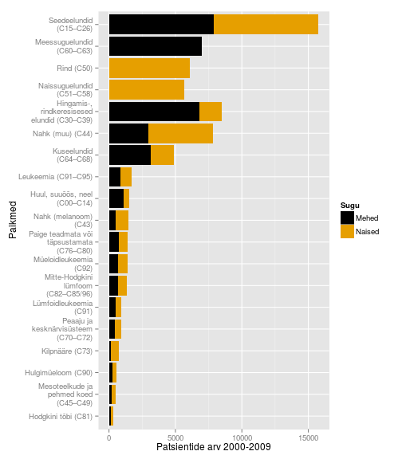
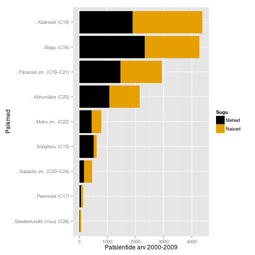

<!-- Limit image width and height -->

<!-- Center image on slide -->

--- .segue .dark .nobackground

## Sissejuhatuseks

--- 
## Vähk
- Mõiste vähk (tuumor, pahaloomuline kasvaja, neoplasm) tähistab suurt hulka erinevaid haiguseid (NCI ~160 olulisemat) mis võivad tekkida kõigis keha kudedes. 
- Vähi tunnuseks on ebanormaalsete rakkude kasv väljapoole nende normaalseid piire. Kõrvalolevate kudede invasioon ja levik teistesse organitesse ehk metastaseerumine.  
- Metastaasid on ka enamuse kasvajatest tingitud surmade põhjustajaks.

[A to Z List of Cancers](http://www.cancer.gov/cancertopics/types/alphalist)

---
# WHO andmetel
- Vähkkasvajad on maailmas üks juhtivatest surma põhjustatavatest haigustest, nõudes 8.2 miljonit elu 2012. a (EU-27 osakaal 2012: 1.27 miljonit (15%))
- Kopsu-, maksa-, mao-, kolorektaal- ja rinnakasvajad põhjustavad enim 
vähisurmasid
- sagedasemad vähitüübid on naistel ja meestel erinevad
- ~30% vähisurmadest on tingitud viiest käitumis ja dieediriskist: kõrge BMI, vähe puu- ja aedvilju menüüs, vähene füüsiline aktiivsus, tubakas/suitsetamine, alkohol
- arengumaades põhjustavad 20% vähkidest hepatiidi viirused B ja C ning papilloomiviirused
- ennustatkse, et haigestumus suureneb maailmas 14 miljonilt 2012.a 22 miljonini 2030ndatel

--- .segue .dark .nobackground

## Vähi kolm peamist väljakutset 21. saj maailmas

---&twocol

## Ülekaalulisus ja vähk

***=left

- Obesity is a risk factor for breast (post-menopausal), colorectal, endometrial, kidney, esophageal and pancreatic cancers. 
- People who are overweight or are obese may be at greater risk for cancer recurrence and death. 
- Obesity and overweight rates have increased in countries at all income levels.
- Physical activity and a healthy diet are the two key ways to reduce the risk.

***=right

<footer class="source">Allikas: 
<a href="http://www.cancer.org/research/acsresearchupdates/more/three-top-cancer-challenges-of-the-21st-century?utm_source=MB_Twit&utm_medium=Social&utm_content=Feb03_A&utm_campaign=Feb_2015"> www.cancer.org.
</a>
</footer>

---&twocol

## Suitsetamise tõus arengumaades

***=left

- Üle 1.3 miljardi inimese suitsetab maailmas tubakat. Suitsetamine põhjustab erinevaid kasvajaid ja vastutab 1/5 vähisurmade eest maailmas.
- Lähis-Idas ja Aafrikas on ajavahemikus 1990-2009 sigarettide tarbimine suurenenud 57%.
- Kuigi keskeas suitsetamise maha jätmine vähendab üle 60% kopsuvähi riski, teevad arengumaades seda vähesed.
- Sigarettide maksustamises nähakse vastumeedet, kuid sissetulekud tõusevad kiiremini kui maksud.

***=right

<footer class="source">Allikas: 
<a href="http://www.cancer.org/research/acsresearchupdates/more/three-top-cancer-challenges-of-the-21st-century?utm_source=MB_Twit&utm_medium=Social&utm_content=Feb03_A&utm_campaign=Feb_2015"> www.cancer.org.
</a>
</footer>

---&twocol

## Diagnostika ja teraapia kättesaadavus

***=left

- Tingituna piiratud juurdepääsust diagnostikale ja ravile on madala ja keskmise sissetulekuga maades vähisurmade suhe intsidentsi umbes 20% kõrgem kui arenenud maades.
- Piiratud juurdepääs on tingitud nii kõrgest hinnast, ebapiisavast infrastruktuurist kui personali puudusest.
- Radioteraapia on näidustatud umbes 60% vähipatsientidest, siiski pole see kättesaadav arengumaades elavatele 82% maailma rahvastikule.

***=right

# 30 Aafrika ja Kagu-Aasia riigis puudub radioteraapia teenus täielikult

<footer class="source">Allikas: 
<a href="http://www.cancer.org/research/acsresearchupdates/more/three-top-cancer-challenges-of-the-21st-century?utm_source=MB_Twit&utm_medium=Social&utm_content=Feb03_A&utm_campaign=Feb_2015"> www.cancer.org.
</a>
</footer>

---

## Erinevused 5-aasta elulemuses maailmas

---

## Kõige sagedasemad surmaga lõppevad vähid maailmas, 2012 aasta seis:

- 5. kops (1.59M surma)
- maks (745 000)
- magu (723 000)
- kolorektaal (694 000)
- rinnavähk (521 000)
- söögitoru (400 000)

Võrdluseks: 
- 1. südame isheemia (7.4M) 
- 2. insult (6.7M)
- 3-4. COPD ja alumiste hingamisteede infektsioonid (a 3.1M)

---
## Kasvajatesse haigestumus Eestis

Andmed: TAI vähiregister

---
## Kasvajad Eestis paikmete kaupa

Andmed: TAI vähiregister

---
## Sagedasemad paikmed

---
## Seedelundkond

--- 
## Rindkere

---
## Esmased vähid ja 5 aasta suremus
# Sõltuvalt vähitüübist võib elulemus varieeruda 10% kuni 90% 

Pilt: Marshall, 2011.

---
## Vähiravi/teraapiad
- lõikus
- kemoteraapia,
- kiiritusravi,
- märklaud teraapiad
  - bioloogiline ravi
- angiogeneesi inhibiitorid

---
## Vähiravimid
Top 10 best-sellerit vähiravimite hulgas 2013 (maailmas):

Bränd | näidustus | globaalne müük | firma (aktsia)
------| --------- |----------------| ------
Rituxan/MabThera | non-Hodgkin's lymphoma, CLL | $7.78 billion | Roche (RHHBY34.06-2.27%)
Avastin | Colorectal, lung, ovarian and brain cancer | $6.75 billion | Roche
Herceptin| Breast, esophagus and stomach cancer | $6.56 billion | Roche
Gleevec| Leukemia, GI cancer | $4.69 billion | Novartis (NVS97.68-0.97%)
Alimta | Lung cancer | $2.7 billion | Eli Lilly (LLY83.34-0.48%)
Velcade |  Multiple myeloma | $2.6 billion | Takeda, J&J (JNJ95.01-1.26%)
Erbitux | Colon and head and neck cancer| $1.87 billion |  Merck, BMS (BMS42.57-0.23%)
Lupron, Eligard | Prostate and ovarian cancer | $1.73 billion |AbbVie, Takeda; Sanofi, Astellas
Zytiga| Prostate cancer | $1.7 billion | J&J
Revlimid | Multiple myeloma, mantle cell lymphoma | $1.09 billion | Celgene (CELG122.83-0.17%)

---
## Ravimiresistentsus

- Üks peamiseid limiteerivaid faktoreid mis määrab süsteemse vähiravi efektiivsuse
- kliinliselt defineeritakse ravimiresistentsena selline vähk mis progresseerub ravi käigus
- peale resistentse haiguse välja kujunemist reeglina muudetakse ravi, võetakse kasutusele mõni teist tüüpi (teisest klassist) ravim
  - eelduseks on et vähi poolt omandatud resistentsus on permanentne ja "päritav" omadus
- võib piisata ka sama ravi jätkamisest peale "ravipuhkust"

--- .segue .dark .nobackground
## Kursus

---
## Kursuse eesmärgid

- selgitada vähkkasvajate tekke molekulaarseid ja rakulisi mehhanisme
- selgitada vähiravi printsiipe

---&twocol

## Raamat

***=left

- Robert A. Weinberg    
<b>The Biology of Cancer</b>  
New York, Garland Science, 2007   
Kohaviit: 616/W-46

***=right

---

## Artikkel: The Hallmarks of Cancer

- Hanahan, D., and R. A. Weinberg. 2000. The Hallmarks of Cancer. Cell 100:57-€“70.
- Hanahan, D., and R. A. Weinberg. 2011. Hallmarks of Cancer: The Next Generation. Cell 144:646-€“674.

Pilt: Hanahan and Weinberg, 2011.

---&twocol

## Teemad

***=left

- vähitüübid, vähitekkeprotsess
- onkogeenid
  - kasvufaktorid ja retseptorid
  - signaalirajad
- tuumor-suppressor geenid
  - pRb ja rakutsükkel
  - p53 ja apoptoos

***=right

- genoomi stabiilsus/ebastabiilsus
- angiogenees
- kasvaja mikrokeskkond
- invasiivsus metastaas
- kasvaja immunsus ja immunoteraapia
- ravimiresistentsus

--- .segue .dark .nobackground

## Kasvaja molekulaarne portree

---
## Kasvaja genoomika
- Täpsusmeditsiini üheks võimaluseks on patsiendi geneetilise info kasutamine ravis   

- Kasvaja genoomika eesmärgiks on personaalse meditsiini arendamine kasutades DNA sekveneerimist ja analüüsimist selleks, et määrata spetsiifilise kasvajaga seotud geneetilised muutused

- Vähirakkudes toimunud muutuste mõistmine lubab arendada efektiivsemaid ravistrateegiaid lähtuvalt konkreetse patsiendi vähi geneetilisest profiilist

---
## The Cancer Genome Atlas

[TCGA](http://cancergenome.nih.gov/abouttcga/overview):
- To collect and characterize more than 20 tumor types
- Each cancer will undergo comprehensive genomic characterization and analysis
  - eksoomi sekveneerimine
  - ekspressiooni ja SNP kiibid
  - proteoomika
- Data are freely available and can be accessed by the cancer community through the TCGA Data Portal and the Cancer Genomics Hub (CGHub).

--- .segue .dark .nobackground

## Lingid loengutele

--- &twocol 

***=left 

- [Sissejuhatav loeng](http://tpall.github.io/sissejuhatus)
- [Vähitüübid](http://rpubs.com/tapa741/vahityybid)
- [Onkoviirused](http://tpall.github.io/Onkoviirused)
- [Onkogeenid](http://tpall.github.io/Onkogeenid)
- [Retseptorid](http://tpall.github.io/Retseptorid)
- [Signaalirajad](http://tpall.github.io/Signaalirajad)
- [Tuumorsupressorgeenid](http://tpall.github.io/Tuumorsupressorid)
- [Rakutsüklikontroll](http://tpall.github.io/Rakutsyklikontroll)

***=right 

- [p53 ja apoptoos](http://tpall.github.io/p53-ja-apoptoos)
- [Immortalisatsioon](http://tpall.github.io/Immortalisatsioon)
- [Tumorigenees](http://tpall.github.io/Tumorigenees)
- [Genoomiterviklikkus](http://tpall.github.io/Genoomiterviklikkus)
- [Mikrokeskkond](http://tpall.github.io/Mikrokeskkond)
- [Metastaasid](http://tpall.github.io/Metastaas)
- [Immuunsus](http://tpall.github.io/Immuunsus)
- [Vähiravimid](http://tpall.github.io/Vahiravim)

---
### Viited
[1] D. Hanahan and R. A. Weinberg. "Hallmarks of Cancer: The Next
Generation". In: _Cell_ 144.5 (2011), pp. 646 - 674. ISSN:
0092-8674. DOI: http://dx.doi.org/10.1016/j.cell.2011.02.013.
<URL:
http://www.sciencedirect.com/science/article/pii/S0092867411001279>.

[2] E. Marshall. "Cancer Research and the \$90 Billion Metaphor".
In: _Science_ 331.6024 (2011), pp. 1540 - 1541. DOI:
10.1126/science.331.6024.1540-a. eprint:
http://www.sciencemag.org/content/331/6024/1540.1.full.pdf. <URL:
http://www.sciencemag.org/content/331/6024/1540.1.short>.

